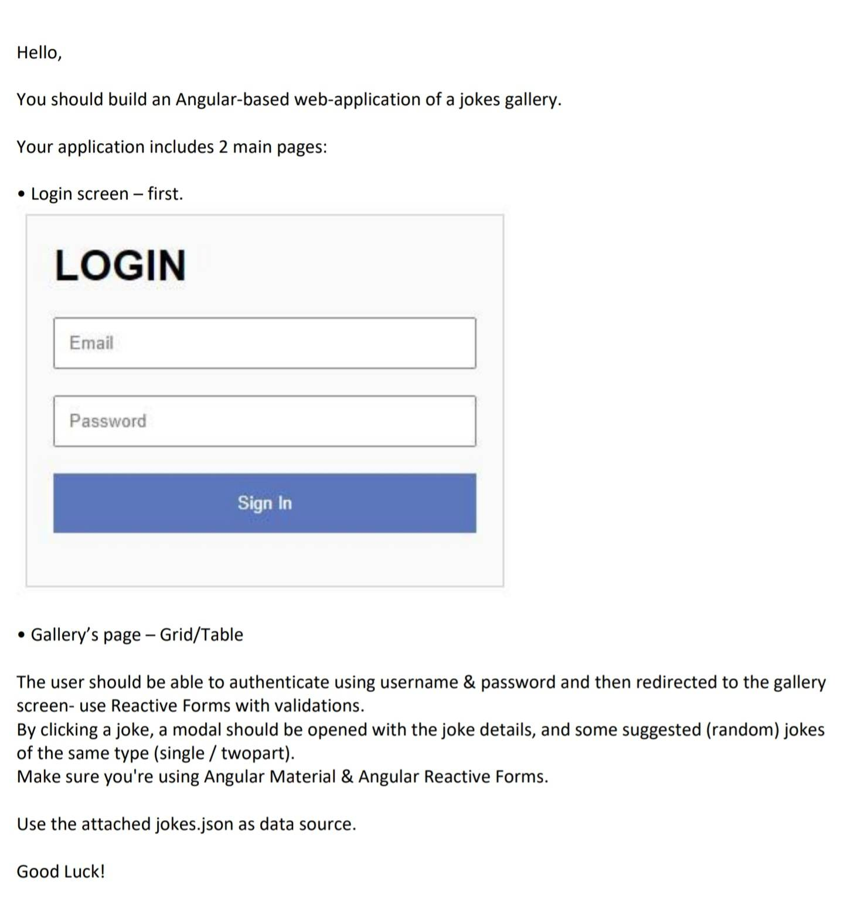

# Jokes

Small demo project that implements this task:

## Development server

Run `ng serve` for a dev server. Navigate to `http://localhost:4200/`. The application will automatically reload if you change any of the source files.

The project is configured to build into the `docs` folder to allow deployment on GitHub.
